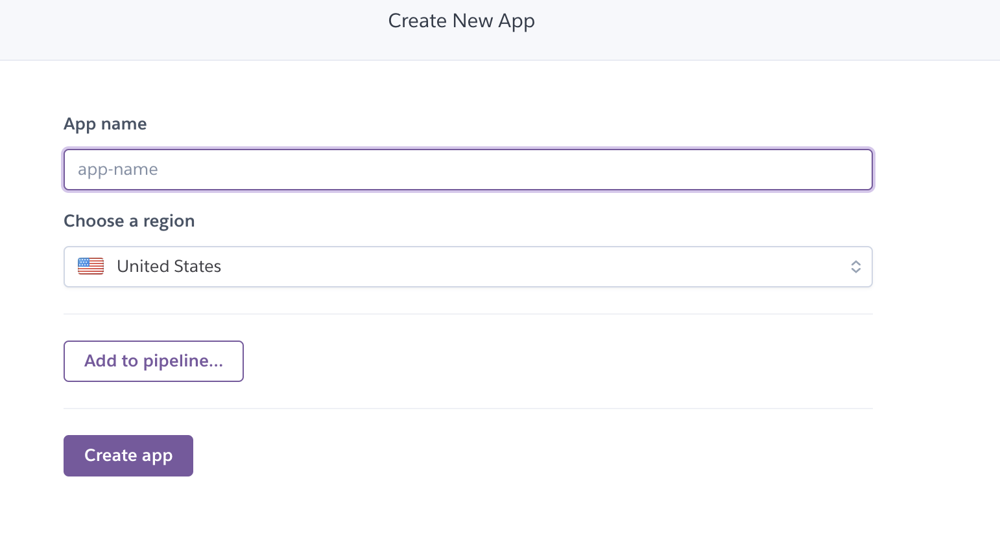
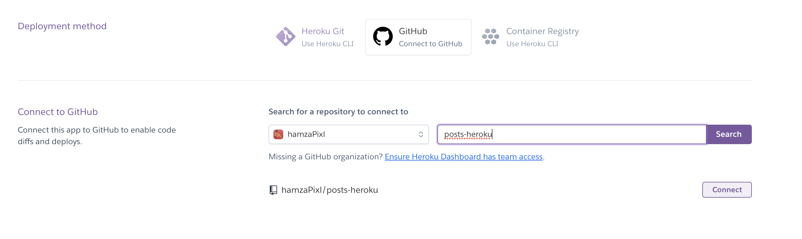
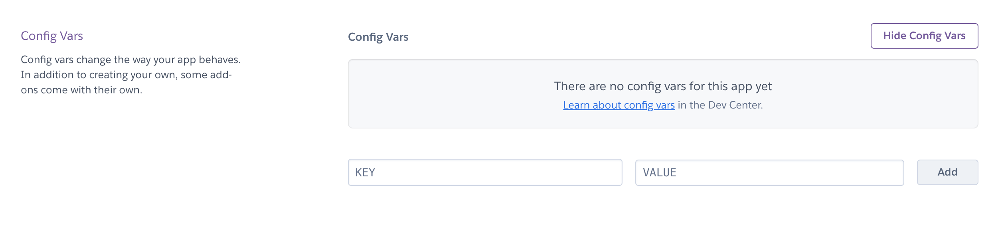
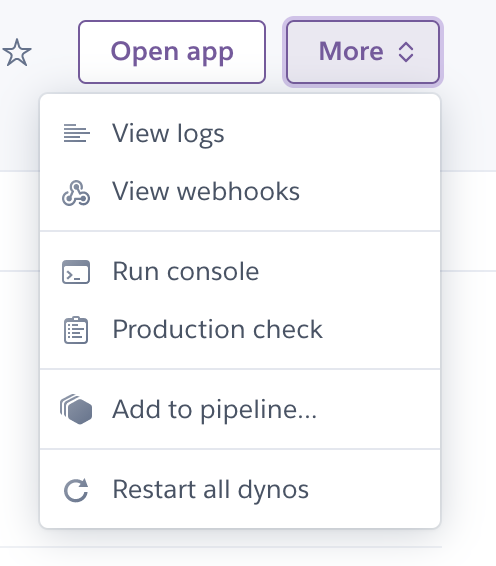
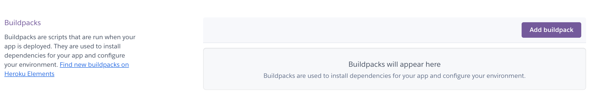
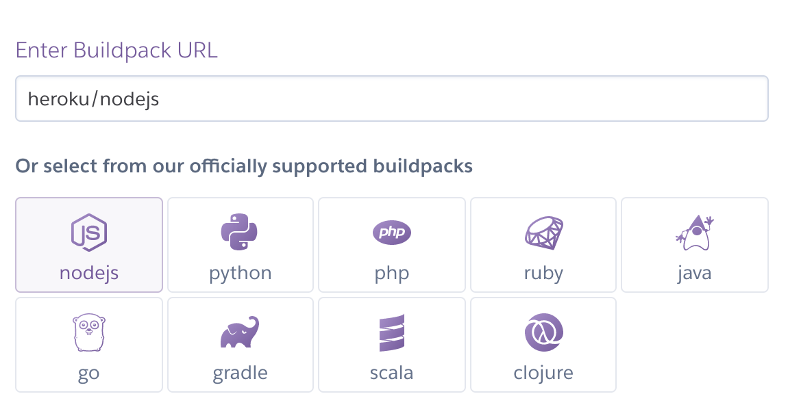
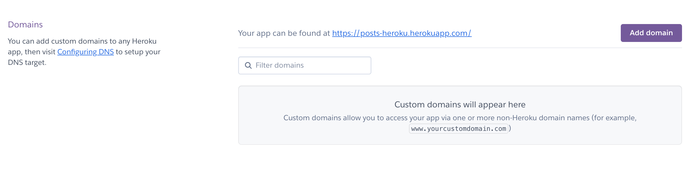
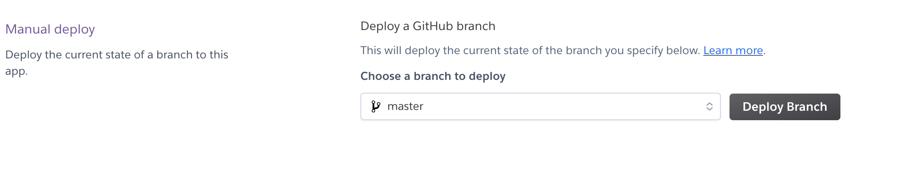
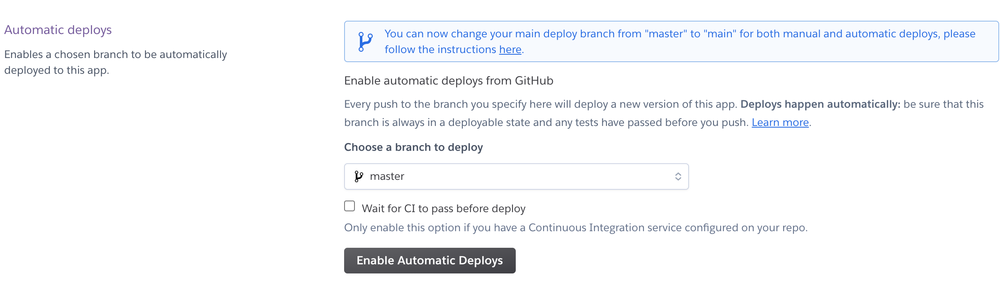

# Go to production with Heroku

## Introduction

We are going to see in this blog post how you can deploy your first `nodejs` application to [Heroku](https://www.heroku.com/). This will allows you to have it online with a custom `URL` if you want.

Heroku is a simple provider that allows you to deploy any web application. It is faster hence their integration with your Github profile. Is pretty much the same thing that we did previously in the [Netlify](https://hmounir.com/pensieve/netlify) blog post.

## Create a new app

Let's start with a new application. You can create a new one on your dashboard, and just follow the lead! Should be very easy! Define the `name` of your application and choose a suitable region.



## Repository

Once you created your application you can connect it to a GitHub repository which is the aim of the blog post here. Helping you to get the possibility to go into production with simple integration. Of course, you can use the Heroku CLI also to build it in another way.

We choose here the Github integration which is way cooler.



Once the connection between Heroku and your Github repository is done, it's there you have an empty application available on the `dashboard`. You can here open the application ( will redirect you to the main URL ).


## Config

For some applications, you want to add config `vars`. So that on the runtime of your application you use these specific values. It's used most of the time to define for example the `origins URLs`, a port that is using, and more ...



## Logs

Heroku has a nice view of logs. You can find them there and also be able to export them and see what happened during the time the application crashes.



## Buildpack

To build your application Heroku needs to know which kind of build pack there are going to use. Here for example we have the last application that we did on the [validation blog post](https://hmounir.com/pensieve/validation).



It's a nodejs application so let's use the nodejs one.



## Domain

Of course, you can define your custom domains. To have it on the URL and be 100% professional.



## Deploy

This section allows you to deploy any branch that you want manually. Here we chose the `master` because we only want to deploy the main branch. but imagine you have a `feature` branch you can too.



## Automatic Deploy

Automatic deployment can be awesome and be such a gain of time. I always use it. Once you merge your feature branch into master, making a release, it will automatically deploy it to production.



## Procfile

To start your application Heroku needs to know how they will start it once the build is done. For a web application, you can define it as the example below.

```shell
web: yarn start
```

## Slug

Sometimes your application or even your repository contains some data that you don't necessarily need to be on the slug of your application. For example, a folder containing logs that you don't use on your application. If they are on your repository they will be added to the build and push to production.

There is a way to ignore them, you can simply add the path to the file `.slugignore`.

Example :

```shell
/logs
```

## Source

[Github](https://github.com/hamzaPixl/blog-posts/tree/posts/heroku)

[Blog](https://hmounir.com/pensieve/heroku)

[Heroku](https://www.heroku.com/home)

## License

Distributed under the MIT License. See `LICENSE` for more information.

## Contact

Hamza Mounir - [@pixlhamza](https://twitter.com/pixlhamza) - hamza.pixelle@gmail.com

## Support

Give a ⭐️ if you like this post!
