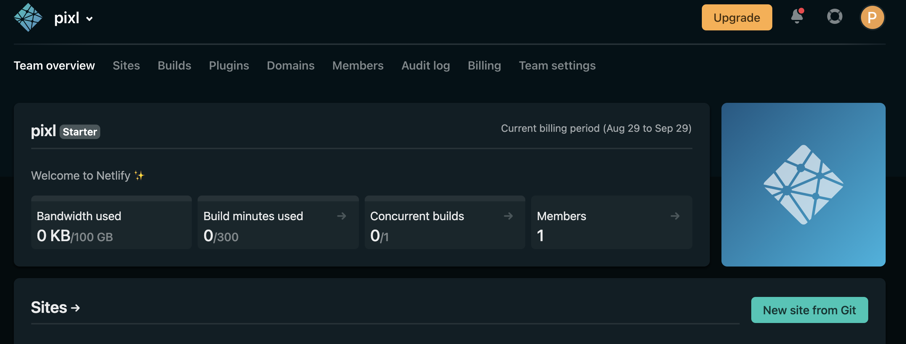

## Introduction

Nowadays creating an HTML page is so easy or even a react app, how about publishing them with a few clicks on this lovely mouse?
Integration becomes more and more the key to development using tools that helps you to move so fast on building your business. Focusing more on your productivity and let some part be managed by people who worked on it. Creating your react application is a thing going to production, we live with the website is another. With [Netlify](https://www.netlify.com/) you can deploy your website with peanut configuration for any web app.

Were going to see here how this integration work and how you can be live easily with Netlify. Some requirements for this, you will need to own an account on Github for the repository, and creating a free Netlify account for the deployment part. Yup, you read it it's free. You can also attach it to your custom domain and be transparent about the provider.

## Creating a repository

We are going to create a simple `react app` for that and push it to our `repository`.

Creating the `react` app:

```shell:title=bin/composer
#!/bin/bash
npx create-react-app netlify-test
```

Push to the repository:

```shell:title=bin/composer
#!/bin/bash
cd netlify-test && git push
```

## Netlify account

Now you need to create your Netlify account for that you just have to follow the few steps that are on their website.



Once you got your account you have this overview and a button where you can add a new website.

## Github Integration

Here comes the integration part to your repository where you pushed yours react app before. You can link it via the button `New site from Git` after that you just have to follow the steps and connect to your `Github account` to grant access to it.


## Deployment

To prepare the deployment you have to set up it on the last step of your GitHub repository integration. To run our application we are going to serve the `build` and add the configuration to Netlify.


You have of course some `logs` about the deployment to see if everything runs fine.


## Custom domain

You can choose to add a `custom domain` to your application, you can easily found that on the settings of the website.


## Live to production

Here it comes you have an `URL` to go with it.


## Source

[Github](https://github.com/hamzaPixl/blog-posts/tree/posts/netlify)

## License

Distributed under the MIT License. See `LICENSE` for more information.

## Contact

Hamza Mounir - [@pixlhamza](https://twitter.com/pixlhamza) - hamza.pixelle@gmail.com

## Support

Give a ⭐️ if you like this post!
